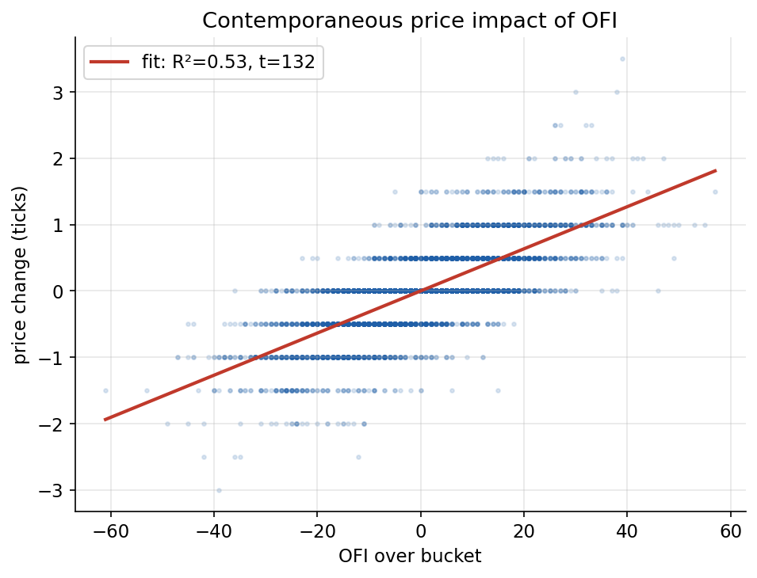
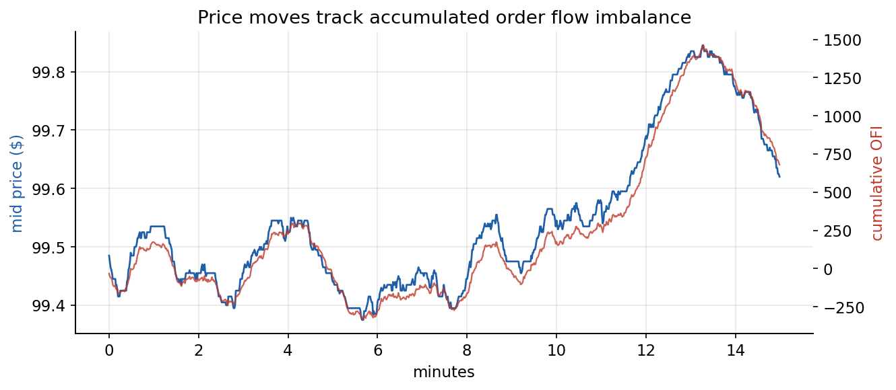
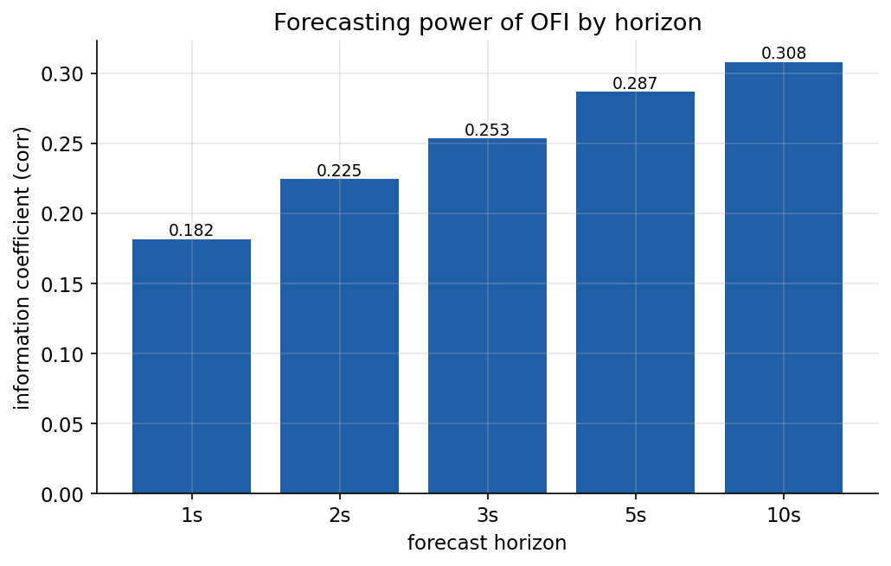
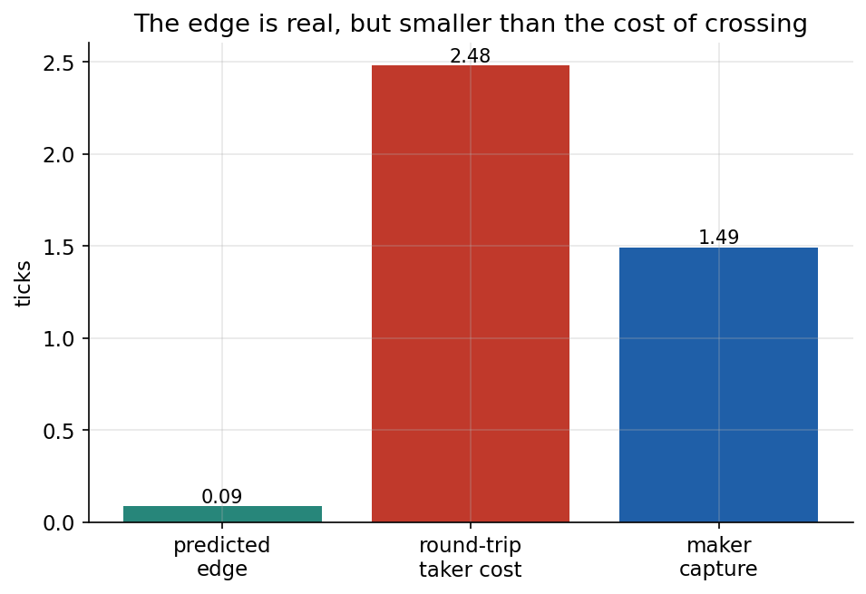
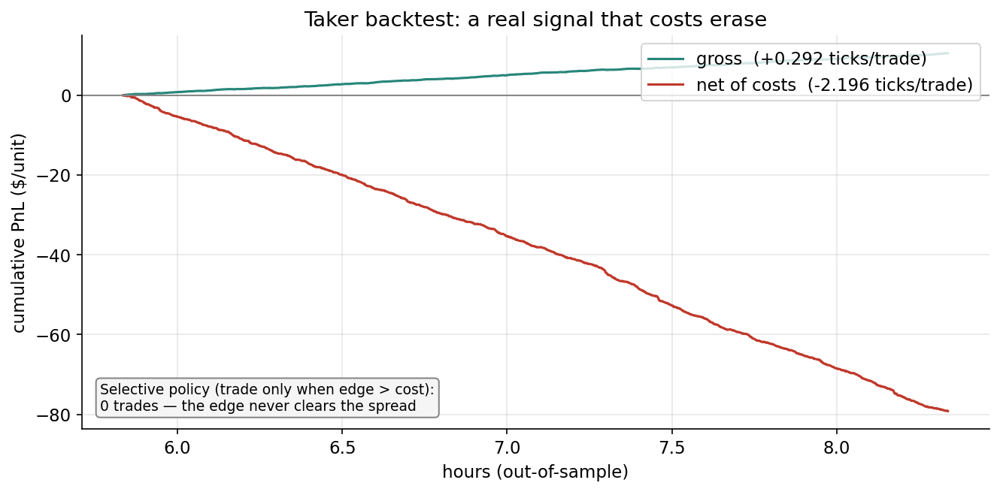
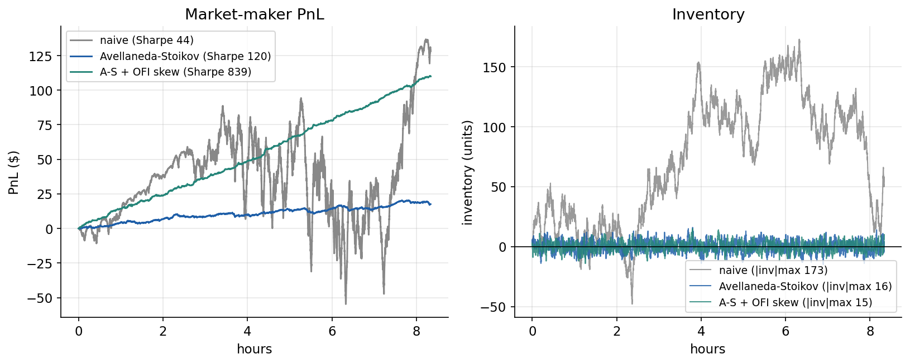

# Order Flow Imbalance

Luke Yin

Builds Order Flow Imbalance (OFI) from limit-order-book data and tests whether it
predicts short-horizon price moves, and whether the edge is large enough to trade. It
predicts moves but is not tradable by a liquidity taker: the predictable move is
smaller than the spread. A market maker can use the same signal to control
inventory and improve its risk-adjusted return.

Reproducible from a fixed seed: `python scripts/run_analysis.py` (about 4 seconds). A
live Binance collector is included so the same pipeline runs on real data.

## Summary

- OFI explains 53% of contemporaneous one-second price moves (R² = 0.53, t = 132), or
  88% using the top five levels.
- It forecasts the next second weakly (IC = 0.18), and the edge holds out of sample
  (IC = 0.19).
- The predicted move (0.09 ticks) is about 29x smaller than the round-trip taker cost
  (2.48 ticks), so a cost-aware taker makes 0 trades.
- Skewing Avellaneda-Stoikov quotes by OFI keeps inventory tightly bounded (±15 vs ±173
  for naive quoting) while recovering most of the PnL that plain inventory control gives
  up ($110 vs $18), the best risk-adjusted return of the three policies.

## What OFI is

At each book update n, OFI sums signed pressure at the best quotes:

```
dW_n = q_bid_n              if bid price rose      (buyers improving)
       q_bid_n - q_bid_n-1  if bid price unchanged (queue building/eroding)
      -q_bid_n-1            if bid price fell      (buyers pulling)

dV_n =-q_ask_n-1            if ask price rose      (sellers pulling)
       q_ask_n - q_ask_n-1  if ask price unchanged
       q_ask_n              if ask price fell      (sellers improving)

OFI contribution  e_n = dW_n - dV_n
```

Summed over a one-second bucket, positive OFI is net buying pressure. It is the only
feature used.

## Data

Exchange APIs are not reachable from the build environment, so the headline results use
a calibrated event-driven LOB simulator (`src/simulator.py`). The OFI/price relationship
is emergent, not imposed:

- a latent state follows a slow Ornstein-Uhlenbeck process and is never exposed to the
  analysis;
- it tilts market-buy versus market-sell arrivals, so order flow carries persistent
  information;
- market orders consume the resting queue, and a price level moves only when its queue
  empties.

Calibration targets a 1-tick median spread, roughly 2% daily volatility, and 32% of
events being trades.

To run on real data, `scripts/run_collect.py` streams the Binance top-of-book
(`@depth20@100ms`) into the same schema:

```bash
pip install websocket-client
python scripts/run_collect.py --symbol btcusdt --minutes 30
```

`binance.com` is geo-restricted in some regions (HTTP 451 in the US); add `--venue us`
for Binance.US.

## Figures

### Price impact



Regressing the per-second mid-price change on OFI gives R² = 0.53 (t = 132). Using the
top five levels (Xu et al. 2020) raises it to 0.88.



### Forecasting

The one-second information coefficient is 0.18 (R² = 0.03) and rises with horizon (0.31
at 10s), because the flow is persistent. A model fit on the first 70% of the sample
holds on the last 30% (IC 0.18, out of sample 0.19).



### Transaction costs

The predicted next-second move averages 0.09 ticks. A taker round trip costs 2.48 ticks
(two spread crossings plus fees), about 29 times the edge. Out of sample the signal is
positive gross (+0.29 ticks/trade) and negative net (-2.20 ticks/trade). A taker that
only trades when the edge clears the cost makes 0 trades.




### Market making

A market maker earns the spread but must control inventory and avoid being run over by
informed flow. Plain Avellaneda-Stoikov quoting bounds inventory but gives up most of
the PnL; adding an OFI skew to the reservation price uses the forecast to position
inventory ahead of the move, recovering the PnL at the same low inventory. Three
policies on the same price path:



| Policy | Final PnL | Max abs. inventory | Sharpe* |
|---|---|---|---|
| Naive symmetric | $128 | 173 | 44 |
| Avellaneda-Stoikov | $18 | 16 | 120 |
| A-S + OFI skew | $110 | 15 | 839 |

*Sharpe is annualized from one-second marks and is large for all policies; compare
across policies, not the absolute level.

## Validation on real data (Binance.US)

The headline numbers come from the simulator. The same pipeline was run on 30 minutes of
live Binance.US BTCUSDT top-of-book (9,808 snapshots, 1,801 one-second buckets, a
~907-tick spread, thinner than global Binance).

| Result | Simulator | Real (Binance.US, 30 min) |
|---|---|---|
| Price-impact R² (1-level) | 0.53 (t=132) | 0.37 (t=15) |
| Multi-level R² (5-level) | 0.88 | 0.64 |
| Forecast IC (1s) | 0.18 | 0.14 |
| Out-of-sample IC (IS to OOS) | 0.18 to 0.19 | 0.15 to 0.13 |
| Edge vs round-trip cost | 29x | 81x |
| Cost-aware taker trades | 0 | 0 |

What reproduces: OFI explains much of the contemporaneous move and keeps a small
out-of-sample forecasting edge on real data. The taker conclusion is stronger live than
in the simulator. The predicted edge is about 80x smaller than the round-trip cost (vs
30x in the sim), and a cost-aware taker still makes 0 trades.

Caveats (30 minutes of a thin venue is a small, noisy sample):

- Taker gross flips negative (-16 ticks/trade vs +0.29 in the sim). The fitted intercept
  biased the position short while the mid drifted up over the short test window. The
  forecasting IC stays positive, so this is small-sample drift, not a sign reversal.
- The market maker runs at BTC scale: the Avellaneda-Stoikov parameters are scaled by
  price level, so on the real capture it fills and keeps inventory bounded (±12 vs ±29
  for naive quoting) with the best Sharpe. The 30-minute sample is too short to confirm
  the OFI-skew PnL advantage seen in simulation.

## How to run

```bash
pip install -r requirements.txt

# full analysis on the simulator (regenerates figures + metrics.json)
python scripts/run_analysis.py

# rebuild the PDF report from its LaTeX source (needs a LaTeX install; the PDF is committed)
python scripts/build_report.py

# run the unit tests
python -m pytest -q

# optional: collect real Binance data, then run the same pipeline on it
pip install websocket-client
python scripts/run_collect.py --symbol btcusdt --minutes 30
python scripts/run_analysis.py --data data/book_btcusdt.csv
```

## Repository layout

```
src/
  simulator.py     calibrated event-driven LOB simulator
  collector.py     live Binance top-of-book collector (same schema)
  ofi.py           single- and multi-level OFI (Cont-Kukanov-Stoikov)
  features.py      time-bucketing, OFI features, forward-return labels
  analysis.py      price-impact and forecasting regressions, HAC errors, OOS split
  costs.py         taker round-trip cost vs maker capture
  backtest.py      out-of-sample taker backtest, gross vs net
  market_maker.py  Avellaneda-Stoikov quoting: naive / inventory / OFI-skew
  plotting.py      figures
scripts/
  run_analysis.py  end-to-end pipeline
  run_collect.py   real-data collector
  build_report.py  builds the PDF report
tests/             unit tests (OFI values, no-leakage check)
results/           figures + metrics.json
report/            LaTeX source + compiled PDF
LICENSE            MIT
```

## Methodology

- No look-ahead. Forecasting labels use the move after OFI is observed, costs are
  charged at the spread prevailing at trade time, and the model is fit on the training
  period and evaluated on the test period.
- Newey-West (HAC) standard errors, because high-frequency returns are autocorrelated.

## Limitations

- The order book is a calibrated simulator, not real data. The collector is included to
  validate on real captures.
- The market-maker fill model is an Avellaneda-Stoikov intensity, not a queue-position
  simulation. Latency and queue priority are out of scope.
- Second-level Sharpe figures are not comparable to fund-level Sharpes.

## References

- Avellaneda, M. & Stoikov, S. (2008). High-frequency trading in a limit order book. *Quantitative Finance*, 8(3), 217-224.
- Cont, R., Kukanov, A. & Stoikov, S. (2014). The price impact of order book events. *Journal of Financial Econometrics*, 12(1), 47-88.
- Glosten, L. R. & Milgrom, P. R. (1985). Bid, ask and transaction prices in a specialist market with heterogeneously informed traders. *Journal of Financial Economics*, 14(1), 71-100.
- Kyle, A. S. (1985). Continuous auctions and insider trading. *Econometrica*, 53(6), 1315-1335.
- Newey, W. K. & West, K. D. (1987). A simple, positive semi-definite, heteroskedasticity and autocorrelation consistent covariance matrix. *Econometrica*, 55(3), 703-708.
- Xu, K., Gould, M. & Howison, S. (2020). Multi-level order-flow imbalance in a limit order book. *Market Microstructure and Liquidity*, 4(3-4).
